# 🍕Laravelの練習
## 🧁Jetstream導入に関するメモ
**やること**
- Jetstreamの導入
- Userテーブルの生成
- 日本語化
- ロゴの変更

**環境**
```
macOS Big Sur 11.3.1
PHP 7.4.19
Composer 2.0.13
Laravel Framework 8.40.0
```
ちなみに、それぞれのバージョン確認方法は以下
```console
$ php -v		//PHP
$ composer --version	//Composer
$ php artisan -version	//Laravel Framework
```

**DB**
- [DB Browser for SQLite](https://sqlitebrowser.org/dl/)を使う
- GUIを使って直感的にDB操作ができるSQLiteツール

**認証ライブラリ**
- [Jetstream](https://jetstream.laravel.com/2.x/installation.html)を使う
- Laravel/UI：バージョン8で非推奨。今後のサポートにも不安あり
- Breeze：必要最低限の認証機能があればいい時はコレ
- Fortify：いろんな認証機能を試してみたいがJetstreamでは過剰な時はコレ

**導入**
- 注意点：Jetstreamは新しいアプリケーションにのみインストールする。既存のものにインストールすると予期せぬ動作、問題が発生する。(マニュアルより)
- livewire vs inertia：フロントエンドをPHP(Blade.php)で実装するならlivewire、vue.jsならinertiaを使う
```console
├ $ laravel new [アプリケーション名] //アプリケーションの雛形作成とJetstreamのインストールを別々に行う場合
|	├> $ composer require Laravel/jetstream //Jetstreamのインストール
|	└> $ php artisan jetstream:install livewire
|		又は $ php artisan jetstream:install livewire ―teams
|		又は $ php artisan jetstream:install inertia
|		又は $ php artisan jetstream:install inertia ―teams
|
└ $ laravel new [アプリケーション名] ―jet  //雛形作成と同時にJetstreamインストールする場合
	├>
	|	    |     |         |
	|	    |,---.|--- ,---.|--- ,---.,---.,---.,-.-.
	|	    ||---'|    `---.|    |    |---',---|| | |
	|	`---'`---'`---'`---'`---'`    `---'`---^` ' '
	|	Which Jetstream stack do you prefer?
 	|	[0] livewire
 	| 	[1] inertia
	|	> livewireを使う場合は0, inertiaを使う場合は1
	|
	└>	Will your application use teams? (yes/no) [no]:
	   	> team機能(各ユーザを任意のチームに割り当てることができる)を使う場合はyes

$ npm install //npmの依存関係をインストール(npmコマンドがない場合、node.jsをインストールする)
$ npm run dev
```

**Usersテーブルを生成する**
- DB設定情報が用意されている`/config/database.php`を開いてデフォルトの`DB_CONNECTION`を変更
```database.php
変更前:
‘default’ => env(‘DB_CONNECTION’, ‘mysql’),

変更後:
’default’ => env(‘DB_CONNECTION’, ‘sqlite’),
```
- .envファイルの環境変数を変更する。
```.env
変更前:
DB_CONNECTION=mysql
DB_HOST=***
DB_PORT=***
DB_DATABASE=***
DB_USERNAME=***
DB_PASSWORD=

変更後:
DB_CONNECTION=sqlite
```
- 以上2つのDB設定情報を変更した後、usersテーブルを自動生成する
```console
$ php artisan migrate 
```

- サーバーを実行してトップページを表示する
```console
$ php artisan serve
```
認証機能が実装されていることが確認できる。
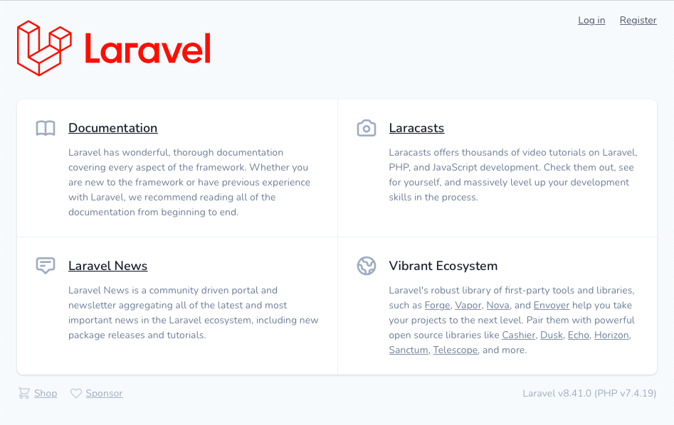
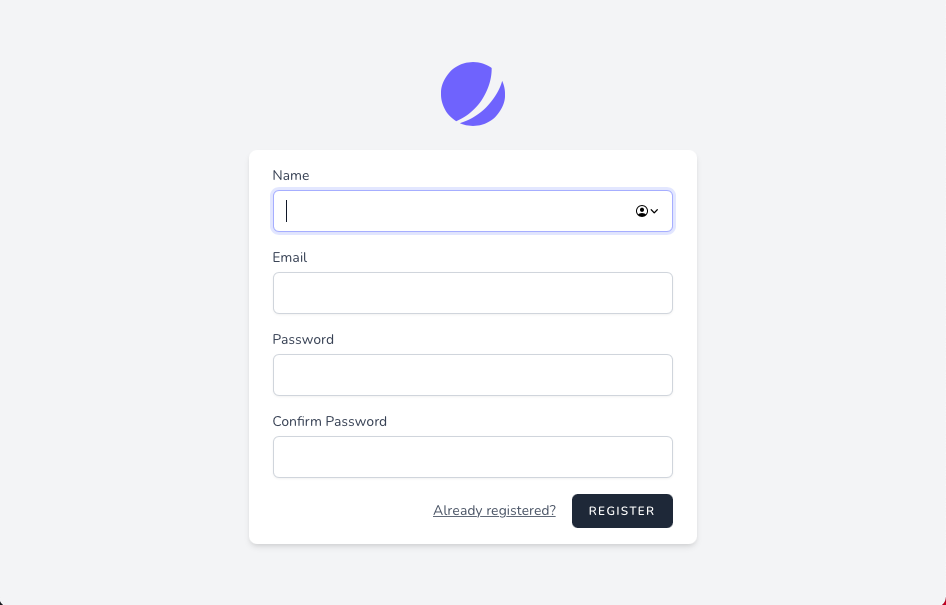
ログインしてみると、JetstreamのDashboardが表示された。ログアウト、プロフィール編集も実装済み！すごい！
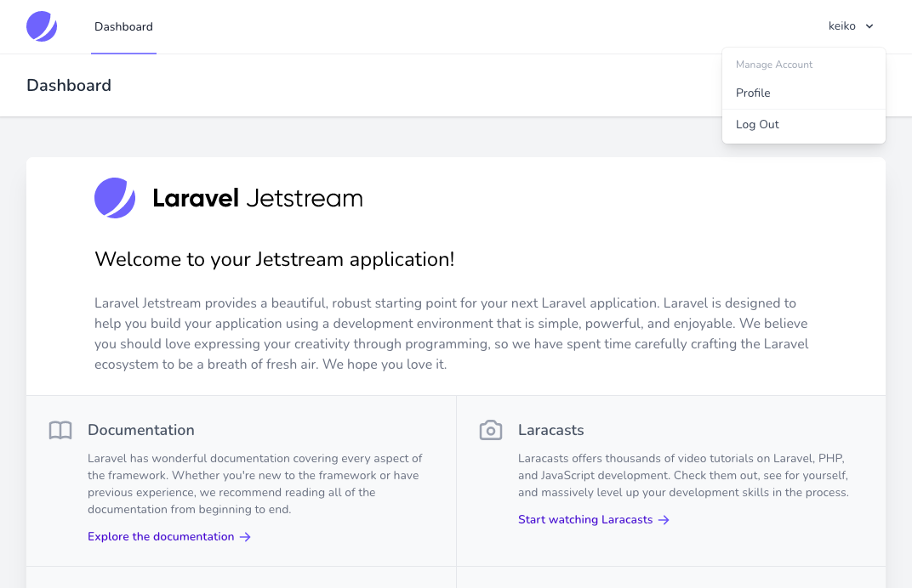

**日本語化する**<br>
このままだと表示が全て英語で使い勝手が悪いので、[Laravel Lang](https://laravel-lang.github.io/lang/)という翻訳ファイルでJetstreamを日本語化します。
- `config/app.php`ファイルの`Locale Configuration`部分を変更
```app.php
変更前:
'locale' => 'en'

変更後:
'locale' => 'ja'
```
- 翻訳ファイルをインストールする
```console
$ composer require laravel-lang/lang:~8.0
```
- 作成されたja.jsonファイルとjaディレクトリをアプリケーションのlangディレクトリ内にコピーする
```console
$ cp ./vendor/laravel-lang/lang/json/ja.json ./resources/lang/
$ cp -r ./vendor/laravel-lang/lang/src/ja ./resources/lang/
```
日本語に翻訳できているのが確認できた。すごい！<br>
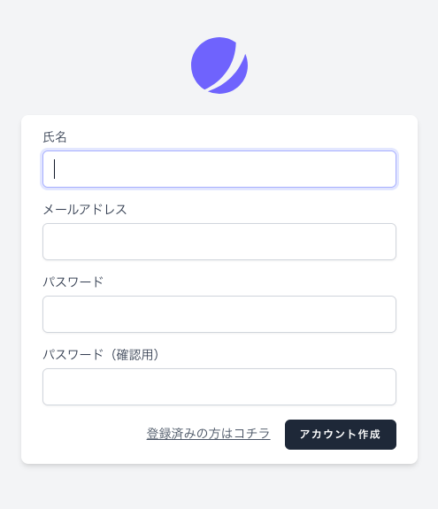
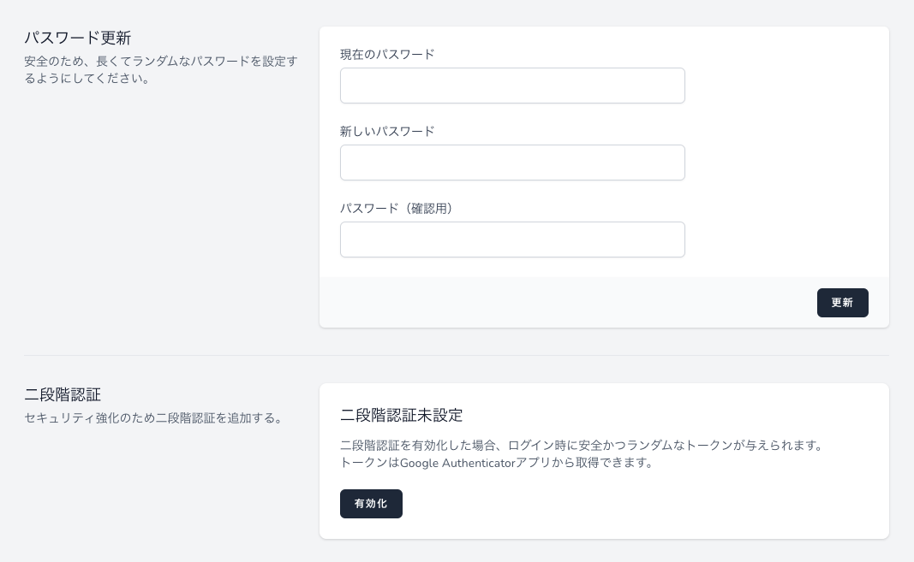<br>
- ただし、バリデーションメッセージ等で日本語化できていない、ないし日本語訳が不適切な文章も多いので、`resources/lang/ja`以下のファイル及び`resources/lang/ja.json`ファイルで個別に日本語訳の設定が必要です。<br>
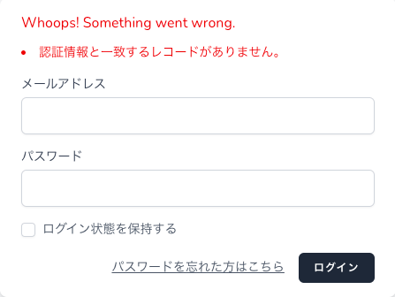<br>

**ロゴを変更する**<br>
Jetstreamのデフォルトの青丸ロゴを変更します。
- Jetstreamの各コンポーネントを編集可能の状態にする。
```console
$ php artisan vendor:publish --tag=jetstream-views
```
これで、`resources/views/vender`フォルダが作成されます。
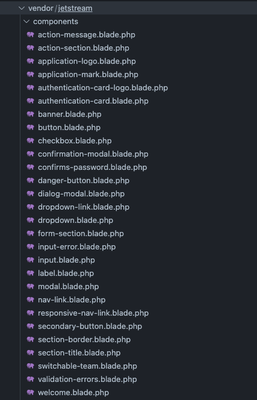
- このうち、編集するファイルは`authentication-card-logo.blade.php`と`application-mark.blade.php`。元のコードをコメントアウトして、aタグ内にimgタグを記述します。今回は商用フリーのイラスト素材を提供してくれる[linustock](https://www.linustock.com/)から取得した画像リンクを使用します。fontawsomeを利用する場合は[コチラのQiita記事](https://qiita.com/manbolila/items/498aae00f3574c72f031)を参照。
```authentication-card-logo.blade.php
変更前：
<a href="/">
　　<svg class="w-16 h-16" viewbox="0 0 48 48" fill="none" xmlns="http://www.w3.org/2000/svg">
   <path d="M11.395 44.428C4.557 40.198 0 32.632 0 24 0 10.745 10.745 0 24 0a23.891 23.891 0 0113.997 4.502c-.2 17.907-11.097 33.245-26.602 39.926z" fill="#6875F5"/>
   <path d="M14.134 45.885A23.914 23.914 0 0024 48c13.255 0 24-10.745 24-24 0-3.516-.756-6.856-2.115-9.866-4.659 15.143-16.608 27.092-31.75 31.751z" fill="#6875F5"/>
   </svg>
</a>

変更後：
<a href="/">
　　
</a>
```
```application-mark.blade.php
変更前：
<svg viewBox="0 0 48 48" fill="none" xmlns="http://www.w3.org/2000/svg" {{ $attributes }}>
  <path d="M11.395 44.428C4.557 40.198 0 32.632 0 24 0 10.745 10.745 0 24 0a23.891 23.891 0 0113.997 4.502c-.2 17.907-11.097 33.245-26.602 39.926z" fill="#6875F5"/>
  <path d="M14.134 45.885A23.914 23.914 0 0024 48c13.255 0 24-10.745 24-24 0-3.516-.756-6.856-2.115-9.866-4.659 15.143-16.608 27.092-31.75 31.751z" fill="#6875F5"/>
</svg>

変更後：

```
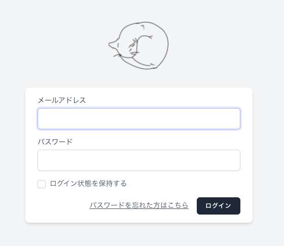<br>
`authentication-card-logo.blade.php`の設定が無事反映されているのが確認できました。

**参考**<br>
- [Jetstream公式ドキュメント](https://jetstream.laravel.com/2.x/introduction.html)
- [3分でJetstreamを日本語化する方法(PHP JUNKIE)](https://php-junkie.net/framework/laravel/jetstream-ja/)
- [【Laravel】初めての認証(Qiita)](https://qiita.com/manbolila/items/498aae00f3574c72f031)

## 🍫Unitテストに関するメモ
### ¶前提事項
```
tests
├ Feature
│   ├ DbHelloTest.php
│   ├ ExampleTest.php
│   └ HelloTest.php
└ Unit
│   └ ExampleTest.php
├ CreatesApplication.php
└ TestCase.php
```
このうち、`$ vendor/bin/phpunit`で実行されるテストは、オプションの`--list-tests`で確認できる。
```console
$ vendor/bin/phpunit --list-tests

PHPUnit 9.5.4 by Sebastian Bergmann and contributors.

Available test(s):
 - Tests\Unit\ExampleTest::testBasicTest
 - Tests\Feature\ExampleTest::testBasicTest
 - Tests\Feature\HelloTest::testHello
```
### ¶Laravel8へのバージョンアップによるエラー
指定アドレスへの**アクセステスト**を実行したところ、エラーが発生した。
```HelloTest.php
use Illuminate\Foundation\Testing\RefreshDatabase;
use Illuminate\Foundation\Testing\WithFaker;
use Tests\TestCase;
use App\Models\User;

class HelloTest extends TestCase
{
 use RefreshDataBase;
 
 public function testHello() {
  $this->assertTrue(true);
  
  $response = $this->get('/');
  $response->assertStatus(200);

  $response = $this->get('/home');
  $response->assertStatus(302);
  
  $user = factory(User::class)->create();  //ここが問題
  $response = $this->actingAs($user)->get('/home');
  $response->assertStatus(200);
  
  $response = $this->get('/no_route');
  $response->assertStatus(404);
 }
}
```
上記ファイルの実行結果が以下。
```console
$ vendor/bin/phpunit tests/Feature/HelloTest.php

PHPUnit 9.5.4 by Sebastian Bergmann and contributors.

E                                                                   1 / 1 (100%)

Time: 00:00.218, Memory: 24.00 MB

There was 1 error:

1) Tests\Feature\HelloTest::testHello
Error: Call to undefined function Tests\Feature\factory()
```
調べたところ、laravel8ではfactory()の表記の仕方が変更になっていた。したがって
```HelloTest.php
$user = factory(User::class)->create();
```
の部分を以下のように変更。
```HelloTest.php
$user = User::factory()->create();
```
修正後の実行結果が以下。無事テストを通過。
```console
$ vendor/bin/phpunit tests/Feature/HelloTest.php

PHPUnit 9.5.4 by Sebastian Bergmann and contributors.

.                                                                   1 / 1 (100%)

Time: 00:00.310, Memory: 26.00 MB

OK (1 test, 5 assertions)
```

**データベーステスト**でも同様。`factory(Person::class)->create()`は`Person::factory()->create()`に修正して実行する。
```DataHelloTest.php
<?php

namespace Tests\Feature;

use Illuminate\Foundation\Testing\RefreshDatabase;
use Illuminate\Foundation\Testing\WithFaker;
use Tests\TestCase;
use App\Models\Person;

class DataHelloTest extends TestCase
{
    public function test_data()
    {
        Person::factory()->create([  //ここを変更
            'name' => 'XXX',
            'mail' => 'YYY@ZZZ.com',
            'age' => '123',
        ]);

        $this->assertDatabaseHas('people', [
            'name' => 'XXX',
            'mail' => 'YYY@ZZZ.com',
            'age' => '123',
        ]);
    }
}
```
問題なくテストを通過。
```console
$ vendor/bin/phpunit tests/Feature/DataHelloTest.php

PHPUnit 9.5.4 by Sebastian Bergmann and contributors.

.                                                                   1 / 1 (100%)

Time: 00:00.137, Memory: 20.00 MB

OK (1 test, 1 assertion)
```
テスト用のsqliteデータベースに無事格納されていることも確認できた。
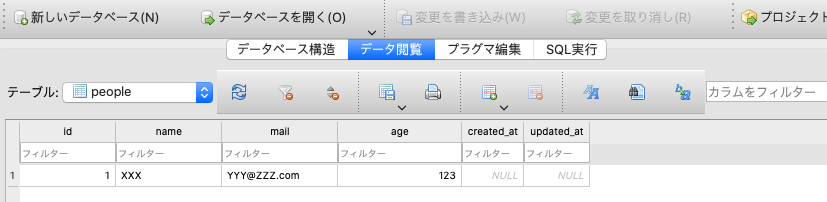
### ¶その他注意事項
#### モデルファイルのパス変更
Laravel8バージョンアップにより、これまで/appの直下に配置されていたモデルファイルが/app/Modelsのなかに格納されることになった。したがってファイルパスも`use App\User;`ではなく`use App\Models\User;`としなければならないことに注意。


## 🍰エラーログとSlack連携に関するメモ
LaravelのエラーログとSlack連携は以下の3ステップで簡単に実装できた。
- SlackにてIncoming WebHooksを追加
- アプリケーションのenvファイルを修正
- アプリケーションのlogging.phpファイルを修正

### ¶実際の流れ
①Slack側でIncoming WebHooksを追加し、インテグレーション用のURlを発行して

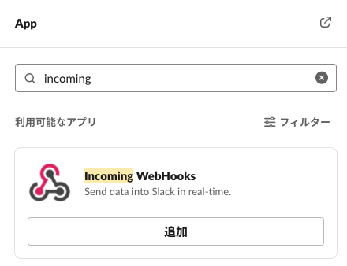

②アプリケーション側の.envファイルに`LOG_SLACK_WEBHOOK_URL=インテグレーション用URL`を追加する
```.env
LOG_CHANNEL=stack
LOG_LEVEL=debug
LOG_SLACK_WEBHOOK_URL=https://hooks.slack.com/... //ここを追加
```
③configフォルダのlogging.phpファイルを編集して完了！

```logging.php
'channels' => [
        'stack' => [
            'driver' => 'stack',
            'channels' => ['single', 'slack'], //ここを追加
            'ignore_exceptions' => false,
        ],
        
        'slack' => [
            'driver' => 'slack',
            'url' => env('LOG_SLACK_WEBHOOK_URL'),
            'username' => 'Laravel Log', //Slackメッセージで表示される発言者名
            'emoji' => ':space_invader:', //Slackメッセージで表示される絵文字
            'level' => env('LOG_LEVEL', 'critical'), //通知するエラーレベル
        ],
```

無事に通知を受け取ることができた。

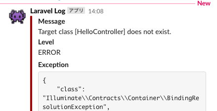

